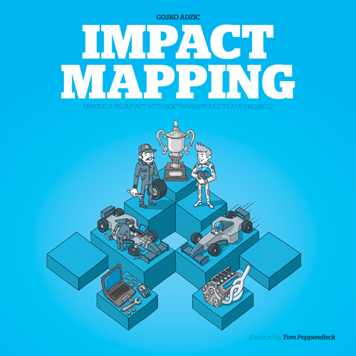

# Design With Impact

Statewide IT 2022 Workshop

Chris Basham

Notes:
Welcome everyone to this workshop. Today, we'll learn about a technique known as impact mapping. First, let's start with some background and logistics.

## Chris Basham

csbasham@iu.edu

UX designer in Enterprise Student Systems.

*Accessibility. Front-end dev. Design systems.*

Notes:
I'm Chris Basham. I've worked at Indiana University since 2012, as a UX designer and front-end developer, working on various web software products. Today, I want to share with you a topic I've been studying and practicing over this last year.

## Outline

| Time  | Duration | Description      |
| -----:| --------:| ---------------- |
| 9:30  |      10m | Introduction     |
| 9:40  |      45m | Part 1: Learn    |
| 10:25 |       5m | Break            |
| 10:30 |      60m | Part 2: Practice |

Notes:
The workshop today is split into two major sections, with a five minute break. We'll learn about impact mapping, then put it into practice.

## Resources

https://github.com/basham/swit-workshop-impact

Notes:
All resources for this workshop, including slides, slide notes, and links, are located on GitHub. This link is posted in the Zoom chat.

## Zoom etiquette

- Raise your hand.
- Submit questions in chat.
- Mute when you're not talking.

Notes:
If you have any questions at any time, please use Zoom to raise your hand or post questions in the Zoom chat. If you're not talking, please mute your microphone.

# Part 1

Learn about impact maps

Notes:
In the first part of the workshop, we'll learn about impact maps and how they fit into the work we do.

## Delivery

Build the thing right.

Notes:
In UITS, most software teams use the Agile development process. You release features and updates in consistent intervals, such as every two weeks. This iteration provides opportunity for the team to get feedback, to learn, and to adapt. Every team will implement this methodology in different ways. Ultimately, the goal of any development methodology is to deliver software in the right way, a way that is predictable and ideally results in high quality work.

## Discovery

Build the right thing.

Notes:
Your team may be able to deliver software in the right way, but it doesn't mean your team is delivering the right solutions. Product discovery does this. There are many techniques you can use to help your team during this phase.

## Discovery ↓ Delivery

Notes:
You can think of product discovery as the first phase in the development process. Once your team identifies the right thing to do, then you can execute on delivering that right solution. What you do in product discovery feeds into the work you do in Agile.

## Discovery + Delivery

Notes:
We need both phases. Even if it is the most accessible and usable and delightful piece of software your team can deliver — if it doesn't solve the right problem, it is a waste of time. Users will be frustrated because they can't do what they really want. Stakeholders will be frustrated because their vision is not being achieved. The team will be frustrated because their work feels meaningless.

In contrast, if you know the right solution but have no means of executing it well, then the idea is never implemented, or it is delivered late, or it has a poor user experience.

## Discovery activities

Problem space

Solution space

Notes:
There is no prescribed way to conduct the work you do in a discovery phase. Teams will need to find their own way, that fits best according to their situation and constraints. But the activities themselves can be grouped into two main categories: the problem space and the solution space. Successful teams invest more time in the problem space than the solution space.

Source: https://herbig.co/product-discovery/

## Problem space

"Why is this a problem worth solving?"

Align + Research

Notes:
When you work in the problem space, you ask the question, "Why is this a problem worth solving?" You answer this when your team gets alignment with your stakeholders about goals, priorities, and measurements of success. You answer this when your team conducts research with users to understand what they do and why they do it.

## Solution space

"What solutions are worth pursuing?"

Ideate + Create + Test + Refine

Notes:
When you work in the solution space, you ask the question, "What solutions are worth pursuing?" In these activities, you ideate to explore possibilities; you create prototypes; you test those possible solutions; and you refine them based on what you've learned.

## Impact mapping

Problem space + Solution space

Notes:
This workshop is specifically about one discovery technique, known as impact mapping. This technique is useful for making progress in both the problem space and the solution space. It helps the team stay aligned with stakeholders. It helps identify and prioritize research questions. It helps the team to explore different options and identify how to test those options.

## Examples

Notes:
Before explaining what an impact map is and why to use it, let's briefly look at a couple "classic" examples.

Notes:
Impact maps are arranged in a hierarchy, with each level having a unique meaning. A goal that is trying to be achieved is at the top, with everything below it representing things that will help to achieve that goal. In this example, the goal is to "increase mobile advertising" on a music information website.

Notes:
Not all impact maps have to look the same. The structure can be more loose. Levels don't have to be labeled. It could look more like a mind map. In this second example, the goal is for a gaming platform to obtain 1 million active players.

## Website and book

[ImpactMapping.org](https://www.impactmapping.org/)

Notes:
Both of these examples are featured on the website ImpactMapping.org and in the book of the same name.

## Benefits

1. "Road map" for team and stakeholders
2. Communicates scope and priorities
3. Exposes assumptions

Notes:
There are a number of benefits to using impact maps. The map can be a collaboration between the team and stakeholders, so there's an agreement of what is trying to be achieved. The number of items in the map roughly communicates the scope. The order of the items in the map communicates priorities. The connections of the items exposes assumptions.

## Structure

1. Goal
2. Actors
3. Impacts
4. Deliverables
5. Experiments

Notes:
Generally, the hierarchy of an impact map is composed of five levels: goals, actors, impacts, deliverables, and experiments.

## Problem space

1. Goal (align)
2. Actors (align + research)
3. Impacts (align + research)

Notes:
The first three levels (goal, actors, and impacts) represent the problem space. Here, focus on aligning and researching. This is the space where it can be beneficial to collaborate with stakeholders.

## Solution space

4. Deliverables (ideate + create + refine)
5. Experiments (test)

Notes:
The last two levels (deliverables and experiments) represent the solution space. Here, focus on ideating, creating, testing, and refining. This is the space where stakeholders shouldn't be too involved.

## 1. Goal

"What are you trying to achieve?"

Personal. Business. Government.

Notes:
The top of an impact map is the goal. Have one goal per impact map. The goal should answer the question, "What are you trying to achieve?" This idea can be used in any number of domains. Goals could be for your personal life, for a business, for the university, or even for the government.

## Personal goals

Health. Relationships. Finances. Experiences.

Notes:
Personal goals may involve improving your health, improving relationships, improving your financial situation, or having new experiences.

## Business goals

Time. Money. Cost.

Notes:
Business goals may involve saving time, making money, or reducing costs.

## Governmental goals

Social welfare. Economy. Infrastructure. Security.

Notes:
Governmental goals is often more ambitious and broad. It may involve social welfare, the economy, infrastructure, or security.

## SMART goals

- Specific
- Measurable
- Achievable
- Relevant
- Time-based

Notes:
Defining a goal is the most important thing to do, since all your work depends on it. A good goal typically follows some variation of the SMART pattern. This is an acronym. It should be specific, measurable, achievable, relevant, and time-based.

https://en.wikipedia.org/wiki/SMART_criteria

## Go to the moon

President John F. Kennedy on Sept 12, 1962:

> [W]e shall send to the moon… a giant rocket…, and then return it safely to earth…, and do it first before this decade is out….
>
> [N]ew hopes for knowledge and peace are there.

Notes:
Let's take a look at one famous goal. In 1962, President John F. Kennedy outlined one in his "We choose to go to the Moon" speech. He says, "We shall send to the moon a giant rocket, and then return it safely to earth, and do it first before this decade is out." He adds that the reason to do this is "new hopes for knowledge and peace."

https://en.wikipedia.org/wiki/We_choose_to_go_to_the_Moon

https://er.jsc.nasa.gov/seh/ricetalk.htm

## The Eagle has landed

In July 1969, the crew of Apollo 11:

- landed on the moon
- explored for over two hours
- returned safely to Earth

Notes:
In July 1969, the crew of Apollo 11 achieved the goal set by JFK. They landed on the moon, explored for over two hours, and returned safely to Earth.

|||
|---|---|
|**Specific**|Moon. Rocket. USA.|
|**Measurable**|Lunar material. Survive. First.|
|**Achievable**|Invest in jobs and tech.|
|**Relevant**|Cold war.|
|**Time-based**|Dec 31, 1969.|

Notes:
Let's examine this goal a little more, through the lens of SMART.

The goal was specific. It involved the moon, a rocket, and the United States.

The goal was measurable. The crew collected 47.5 pounds of lunar material. The crew returned and survived. The U.S. was the first nation to do it.

The goal was achievable because the U.S. government invested in new companies, in tens of thousands of new jobs, in new technology, and in new materials.

The goal was relevant, because of the Cold War. The U.S. vowed to be first to the moon, so that, as JFK said in that speech, "we shall not see space filled with weapons of mass destruction, but with instruments of knowledge and understanding."

Finally, the goal was time-based, because the deadline was December 31, 1969.

https://en.wikipedia.org/wiki/Apollo_11

## Goal ≠ Mission

Notes:
A goal should not be confused with a vision or mission statement.

## NASA's mission

- Research Earth and beyond
- Develop and fund space tech
- Conduct space exploration
- Share with world

Notes:
For example, NASA has a few different aims. It researches Earth, the solar system, and beyond. It develops and funds space technologies. It conducts space exploration, with humans soon to travel to the moon again and to Mars for the first time. And it does all this with the ultimate vision of benefiting all humankind, by sharing discoveries which results in new products for the public and new knowledge for the next generation.

Each of these can be broken down into goals, but they are not goals in themselves.

https://www.nasa.gov/about/index.html

## 2. Actors

"Who can help or hinder achieving the goal?"

Individuals. Groups. Systems.

Notes:
After goals, the second level is actors. Actors are those who can help or hinder achieving the goal. They can be individuals, groups, or even systems.

## Individuals

- Astronauts
- Analysts
- Engineers
- U.S. President
- Spies

Notes:
Returning to the goal of going to the moon, there are thousands of individuals involved. There are roles at NASA that make obvious contributions to the goal: astronauts, analysts, and engineers. The U.S. President set the goal and is a primary stakeholder. And the government would also be concerned about spies, trying to steal information to advantage the Soviet's space efforts.

## Groups

- Congress
- Other U.S. agencies
- Companies
- American public
- Soviet Union (USSR)

Notes:
As for groups, Congress and other government agencies would also be involved with the mission. Companies help to source material and make necessary products for the mission. The support of the American public is needed. And of course, the Soviet Union is the competition.

## Systems

- Infrastructure
- Supply chains
- Communication
- Life support
- Nature and space

Notes:
There are also many systems that need to be taken into account. Road and rail infrastructure is need to transport supplies. Utilities provide essentials for factories. Reliable communication and life support is needed to make the space missions viable. And you also need to consider that nature itself is a system. You need good breaks in the weather for rocket launches.

## Prioritizing actors

Rank. Sort. Focus. Revisit.

Notes:
In any given problem space, there can be an abundance of actors. Some may be more obvious than others. Take time to brainstorm. But ultimately, you need to determine which actors can provide the biggest impact toward achieving a goal. Select the top ones and order them by that expected impact. Consider the motivations of the actors, toward or against the goal. Revisit and refine this list as you learn more and as you make progress.

## 3. Impacts

"What should the actors do or not do to impact the goal?"

Behavior change.

Notes:
The third level is impacts. It asks the question, "What should the actors do or not do to impact the goal?" Ultimately, you are wanting to identify the change of behavior which should result in progress toward achieving the goal.

## Astronauts

- Study
- Train and practice

Notes:
For example, astronauts need to study, so they know as much about the equipment they're using as the engineers that built them. They need to train and practice so they're in shape and are ready for any situation.

## Congress

- Fund NASA
- Rally public support

Notes:
Congress needs to fund NASA, and they should use their influence to rally for public support of the program.

## Life support

- Maintain pressure and temperature
- Filter and purify air
- Recycle and store water

Notes:
The life support system needs to monitor and manage the environments in which that astronauts will live and work. Practically, pressure, temperature, and humidity needs to be maintained. Oxygen needs to be produced from wastewater, and cleared of carbon dioxide and volatile gases. Air needs to be ventilated. Water needs to be recycled and stored.

https://www.nasa.gov/content/life-support-systems

## 4. Deliverables

"How will you help the actors make the intended impact?"

Solutions.

Notes:
The fourth level of impact maps is deliverables. It asks the question, "How will you help the actors make the intended impact?" These are the solutions you may provide.

## Space suits

Portable life support system (PLSS)

Notes:
Astronauts will need to step out of their crafts and enter space or the lunar surface. So, they'll need space suits. And in order for them to maximize mobility, each suit will need its own portable life support system. This is abbreviated to PLSS.

https://en.wikipedia.org/wiki/Primary_life_support_system

Notes:
This image shows an inside look at the second-generation PLSS. It is the "backpack" that the astronauts wear. Throughout the Apollo Program, there were eight configurations of the PLSS. There was a lot to learn and test along that journey.

*The Apollo Portable Life Support System*. Figure 15, page 15.
https://www.hq.nasa.gov/alsj/ALSJ-FlightPLSS.pdf

## 5. Experiments

"How can you test whether the deliverable will have the intended impact?"

Research. Evidence.

Notes:
The fifth and final level of impact maps is experiments. This asks the question, "How can you test whether the deliverable will have the intended impact?" This will require research and evidence. What you learn from these experiments may result in the solution needing to be refined or new solutions to be explored.

## Testing the PLSS

- Neutral buoyancy tanks (Dallas)
- Orbit (Apollo 9)

Notes:
There were two notable tests of the portable life support system. The first was on Earth, in the neutral buoyancy tanks, in Dallas, Texas. The second was in orbit, during the Apollo 9 mission. Together, this proved the space suits would ready for a lunar landing, during the Apollo 11 mission.

https://en.wikipedia.org/wiki/Primary_life_support_system

Notes:
Pilot Rusty Schweickart performed the first in-space test of the PLSS, during the Apollo 9 mission, in March 1969.

*The Apollo Portable Life Support System*. Figure 26, page 24.
https://www.hq.nasa.gov/alsj/ALSJ-FlightPLSS.pdf

<figure class="fig-impact-map-outline-2 fig-impact-map-outline-2--short">

# Go to the moon (Apollo missions)
## Life support system
### Maintain environment and atmosphere
#### Portable life support system
##### Neutral buoyancy tanks
##### Orbit

</figure>

Notes:
Now, let's arrange a line of these items together in an impact map. You can clearly see how the individual experiments (at the bottom of the map) feeds into the larger goal (at the top of the map). To go to moon, the life support system needs to maintain environment and atmosphere. It needs to do this within a space suit, so the crew can explore the lunar surface. The portable life support system will be tested both on Earth and in Earth orbit, to make sure it is ready for the lunar mission.

This impact map can grow to be as complex and detailed as the problem warrants. And going to the moon is a big and complex problem. So, you can imagine how necessary it is to have some grasp on how the little details involving thousands of hours and millions of dollars, will result in the bigger achievement.

## Problem solving

Solution → (Assumption) → Fix problem

Notes:
Now that I've explained the basics of impact mapping and given you an example, let's step back for a bit.

A substantial amount of work we do in IT, the work we do in our personal lives, the work done in other disciplines and domains — can be described simply as problem solving. A particular solution will fix a particular problem or achieve a particular goal.

There is a lot between those ends. There is a lot of opportunities to get it wrong. Much of what prevents or hinders us from solving the problem is that we assume a particular solution will result in the desired effect.

## Assumptions

Unexamined. Unproved. Unshared.

Notes:
An assumption endangers a desired effect in three ways. They can be unexamined, unproved, unshared, or a mix of them.

## Unexamined

Make an impact map.

Deliverable → (Assumption) → Impact

Notes:
First, an assumption is unexamined when you may not be aware of it or when you may have not thought deeply about it. We can define what we do not know, by writing it down. An impact map is a great way to expose those assumptions, because you see the connections. You assume a deliverable will result in a particular impact, that the solution will solve the problem.

## Unproved

Test and refine.

Deliverable → (Experiment) → Impact

Notes:
Second, an assumption is unproved when you do not verify that the cause will achieve the desired effect. Research helps to test hypotheses. You ask questions. You gather evidence. You analyze. If the hypothesis is proven wrong, you adapt and test again. If it is proven right, the hypothesis is verified, and you can move forward in confidence.

## Unshared

Collaborate and communicate.

Stakeholders + Team

Notes:
Third, an assumption is unshared when it is not widely known. This breakdown easily happens across disciplines. For example, a designer may hand off a sketch of an interface to a developer. That sketch may include a button that behaves in a certain way that may be obvious to the designer and other designers, but it may not be obvious to a developer. Inevitably, a detail is overlooked which may have been caught earlier in the process. This may cause negative effects on the team or even on the end user experience.

## Overcome assumptions

||||
|---|---|---|
|**Unexamined**|→|Make an impact map|
|**Unproved**|→|Test + Refine|
|**Unshared**|→|Collaborate + Communicate|

Notes:
In summary, as problem solvers, we need to have some way to define assumptions, communicate assumptions, and test assumptions. When we do this, we can more confidently know that a particular cause will result in the desired effect. Impact mapping helps us to do this.

# Break

5 minutes

Return at 10:30 AM

# Part 2

Practice making impact maps

Notes:
We've learned about what an impact map is and why it can be a beneficial technique during the discovery phase. Now, let's practice as a group.

## Goal

Collaborate realtime to make impact maps during this workshop

Notes:
First, I want to give you another example of an impact map. This is one that I used to decide this part of the workshop. I've set a goal that we "collaborate realtime to make impact maps during this workshop."

|||
|---|---|
|**Specific**|Participants. Impact maps.|
|**Measurable**|1+ participants. 1+ impact maps.|
|**Achievable**|We have the tech.|
|**Relevant**|Workshop implies activity.|
|**Time-based**|60 minutes.|

Notes:
With this goal, I've tried to make it SMART: It specifically involves us and impact maps. We can measure how many of us are here, how many collaborate, and how many maps we make. It is achievable because we have the technology. It is relevant, because a workshop implies there will some kind of activity. It is time-based, because we have less than an hour to do it.

## Actors

Facilitator

Participants

Tech

Notes:
We could consider three actors in achieving this goal. There's me as the facilitator. You all as participants. And the technology we use to make it happen.

## Facilitator

Prepare

Notes:
The most impactful thing I can do is to prepare.

## Prepare

Choose platform (Google Docs)

Prepare template

Prepare examples

Notes:
Preparing could involve choosing a platform for us to use, such as Google Docs. It could also be preparing some template and examples to get us started.

## Participants

Participate

Notes:
The other thing that will lead to a successful outcome is if you all participate.

## Participate

Edit or comment on a doc

Ask questions

Notes:
Participation could involve editing the Google Doc or commenting on what others do. It could also be simple to ask questions during the workshop.

## Tech

Hinder

Notes:
The technology we use could both enable us to do this activity as well as prevent us from doing this activity.

## Hinder

Limit number of collaborators

Network fails

Notes:
For example, maybe there would have been hundreds of participants in this workshop. Would we encounter some technical limit on the number of collaborators? What if any of our networks fail, so we can't collaborate?

These are things I'm not going to worry too much about. But it's good to be aware of the possibilities.

<figure class="fig-impact-map-outline-2 fig-impact-map-outline-2--short">

# Collaborate on impact maps
## Facilitator
### Prepare
#### Choose platform (Google Docs)
#### Prepare template
#### Prepare examples
## Participants
### Participate
#### Edit or comment on a doc
#### Ask questions
## Tech
### Hinder
#### Limit number of collaborators
#### Network fails

</figure>

<figure class="fig-impact-map-grid">
  <h1 style="--row: 1 / span 4;">Grow mobile advertising</h1>
  <h2 style="--row: 1 / span 4;">Super-fans with mobile devices</h2>
  <h3 style="--row: 1 / span 2;">Come back more frequently</h3>
  <h4>Push updates</h4>
  <h4>Special offers</h4>
  <h3 style="--row: 3 / span 2;">Stay longer</h3>
  <h4>Forums</h4>
  <h4>Chats</h4>
</figure>

<figure class="fig-impact-map-outline">

- Grow mobile advertising
  - Super-fans with mobile devices
    - Come back more frequently
      - Push updates
      - Special offers
    - Stay longer
      - Forums
      - Chats

</figure>

<figure class="fig-impact-map-outline-2">

# Grow mobile advertising
## Super-fans with mobile devices
### Come back more frequently
#### Push updates
#### Special offers
### Stay longer
#### Forums
#### Chats

</figure>

<figure class="fig-impact-map-outline-2 fig-impact-map-outline-2--short">

# Grow mobile advertising
## Super-fans with mobile devices
### Come back more frequently
#### Push updates
#### Special offers
### Stay longer
#### Forums
#### Chats

</figure>

# Special thanks

# Thank you

https://github.com/basham/swit-workshop-impact

Notes:
Once again, the slides and additional resources are on GitHub. Feel free to follow up with me as you need. Thank you for joining me today.
